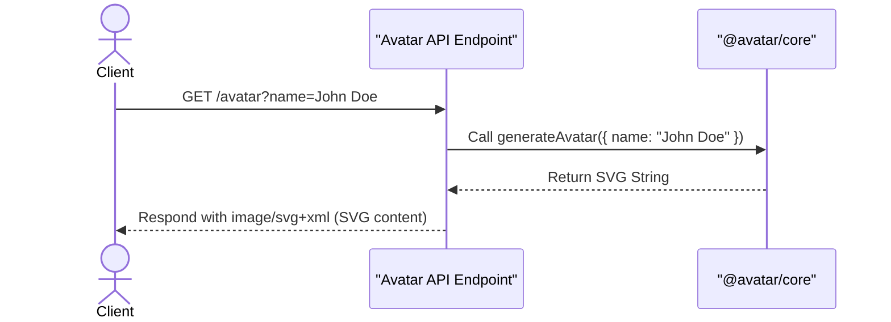
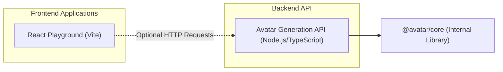

# Glint Monorepo

## Overview

This project provides a straightforward way to generate custom SVG avatars on demand via a simple API endpoint, complemented by a modern React application for general frontend development and experimentation. It helps developers quickly create personalized visual representations or use a ready-to-go React environment without complex setup.

## Installation

Getting this project up and running locally is quite simple.

1.  **Clone the Repository:**
    ```bash
    git clone git@github.com:Charmingdc/glint
    cd glint
    ```

2.  **Install Dependencies:**
    This monorepo uses `pnpm` workspaces. Make sure you have `pnpm` installed.
    ```bash
    pnpm install
    ```

## Usage

This monorepo contains a backend API for avatar generation and a frontend playground application.

### Running the Frontend Playground

To start the React development server for the `playground` application:

```bash
pnpm dev:playground
```

This will typically open the application in your browser at `http://localhost:5173` (or another available port). The `playground` app is a standard Vite + React setup, great for trying out React features.

### Using the Avatar Generation API

The avatar generation API is designed as a serverless-friendly endpoint. While this specific setup doesn't include a dedicated local server for it, you can call it directly once deployed, or integrate it into a local serverless environment.

You can make a `GET` request to the `/avatar` endpoint with a `name` query parameter to generate an SVG avatar.

**Example:**
`GET /avatar?name=Alice`

This would return an SVG image like:
```xml
<svg viewBox="0 0 128 128" width="128" height="128" ...>
  <!-- SVG content for "Alice" -->
</svg>
```

## Features

### On-Demand SVG Avatar Generation
This project offers a dedicated API endpoint capable of dynamically generating personalized SVG avatars. Simply provide a name, and the API returns a scalable vector graphic, perfect for user profiles or placeholder images.



### Modern React Development Environment
The `playground` application provides a pre-configured, high-performance React development setup using Vite. It's ready for rapid prototyping, component development, and exploring modern React features with hot module replacement (HMR) and optimized tooling.

### Monorepo Organization
The entire project is structured as a `pnpm` monorepo, promoting code reusability, consistent dependency management, and efficient development across multiple distinct applications and packages.

## System Architecture / Design

This monorepo comprises a client-side React application that can optionally interact with a serverless-style API endpoint for dynamic content generation.



## API Documentation

This project includes a single API endpoint for avatar generation.

#### `GET /avatar`

**Description**:
This endpoint dynamically generates an SVG avatar. You can customize the avatar by providing a name via a query parameter. If no `name` is provided, it defaults to "John Doe".

**Request**:

Query Parameters:

*   `name` (optional): The name to be used for generating the avatar. E.g., `?name=Jane%20Doe`

**Response**:

Successful responses will return an `image/svg+xml` content type directly, containing the generated SVG data.

```xml
<svg viewBox="0 0 128 128" width="128" height="128" xmlns="http://www.w3.org/2000/svg" ...>
  <!-- Generated SVG content -->
</svg>
```

**Errors**:
The current implementation handles missing names gracefully by defaulting to "John Doe". No explicit error responses are defined for invalid input, as the `generateAvatar` function is expected to return valid SVG in all cases.

**Environment Variables**:
No specific environment variables are required for the avatar API in its current form.

## Technologies Used

| Category          | Technology     | Description                                                                 |
| :---------------- | :------------- | :-------------------------------------------------------------------------- |
| **Frontend**      | React          | A JavaScript library for building user interfaces.                          |
|                   | Vite           | A fast build tool that provides a lightning-fast development experience.    |
|                   | TypeScript     | Superset of JavaScript that adds static types.                              |
| **Backend**       | Node.js        | JavaScript runtime for server-side execution.                               |
|                   | TypeScript     | Superset of JavaScript that adds static types.                              |
| **Monorepo Mgmt** | pnpm           | Fast, disk space efficient package manager.                                 |
| **Linting**       | ESLint         | Pluggable JavaScript linter.                                                |

## Contributing

We welcome contributions to this project! If you're looking to help out, please follow these general guidelines:

1.  **Fork the Repository**: Start by forking the `glint` repository to your GitHub account.
2.  **Clone Your Fork**: Clone your forked repository to your local machine.
3.  **Create a New Branch**: For any new features, bug fixes, or improvements, create a new branch from `main` (e.g., `feature/add-avatar-colors`, `bugfix/fix-playground-styles`).
4.  **Make Your Changes**: Implement your changes, ensuring you follow the existing code style and conventions.
5.  **Test Your Changes**: If applicable, add or update tests for your changes. Ensure all existing tests pass.
6.  **Commit Your Changes**: Write clear, concise commit messages.
7.  **Push to Your Fork**: Push your branch to your forked repository on GitHub.
8.  **Open a Pull Request**: Submit a pull request to the `main` branch of the original `glint` repository. Provide a detailed description of your changes and why they are necessary.

## License

This project is not currently licensed.

## Author Info

-   **LinkedIn**: [Your LinkedIn](https://linkedin.com/in/yourusername)
-   **X (Twitter)**: [@yourhandle](https://x.com/yourhandle)

---

[](https://www.npmjs.com/package/dokugen)