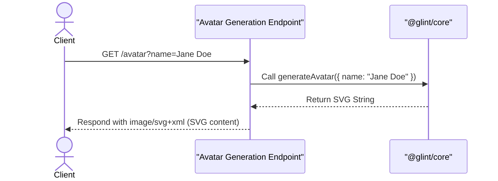
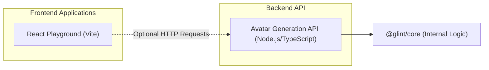

# Glint Monorepo

## Overview

You know how sometimes you just need a quick, unique avatar for a user without all the fuss? This project is built for exactly that! It helps you instantly generate custom SVG profile pictures through a super simple API. Plus, it gives you a lightning-fast React development environment for when you want to prototype new frontend ideas in a breeze. It's all about getting things done efficiently.

## Installation

Getting this project up and running on your local machine is pretty straightforward.

1.  **Clone the Repository:**

    ```bash
    git clone git@github.com:Charmingdc/glint
    cd glint
    ```

2.  **Install Dependencies:**
    This monorepo uses `pnpm` workspaces, so make sure you have `pnpm` installed.

    ```bash
    pnpm install
    ```

## Usage

This monorepo has two main parts: a frontend playground application and an API for generating avatars.

### Running the Frontend Playground

To fire up the React development server for the `playground` application:

```bash
pnpm dev:playground
```

This command will usually open the application in your browser at `http://localhost:5173` (or whatever port is available). The `playground` app is a standard Vite + React setup, great for experimenting with React features and for quick prototyping new UI components.

### Using the Avatar Generation API

The avatar generation API is designed to be lightweight and serverless-friendly. While there isn't a dedicated local server for it in this setup (it's often deployed as a serverless function), you can easily call it directly once it's deployed, or integrate it into a local serverless environment like Vercel Functions.

Just send a `GET` request to the `/avatar` endpoint, including a `name` query parameter, to generate a custom SVG avatar.

**Example Request:**
`GET /avatar?name=Alice`

This will return an SVG image, something like this:

```xml
<svg viewBox="0 0 128 128" width="128" height="128" xmlns="http://www.w3.org/2000/svg">
  <!-- SVG content for "Alice" -->
  <rect x="0" y="0" width="128" height="128" fill="#F0F8FF"/>
  <text x="50%" y="50%" dominant-baseline="middle" text-anchor="middle" font-size="48" fill="#4B0082">Al</text>
</svg>
```

## Features

### On-Demand SVG Avatar Generation

This project offers a dedicated endpoint that can dynamically create unique SVG avatars. You just pass in a name, and the system returns a scalable vector graphic. This is super useful for user profiles, as a placeholder, or for any scenario where you need quick visual identity.



### Modern React Development Environment

The `playground` application gives you a high-performance React development setup, pre-configured with Vite. It's all set up for rapid prototyping, building components, and exploring new React features, with benefits like hot module replacement (HMR) and optimized tooling right out of the box.

### Monorepo Organization

The entire project is structured as a `pnpm` monorepo. This helps keep things organized, makes code easier to share between different parts of the project, manages dependencies consistently, and generally speeds up development across separate applications and packages.

## System Architecture / Design

This project is organized as a monorepo, integrating a client-side React application with a serverless-style API endpoint for dynamic content generation. An internal `@glint/core` package handles the core avatar generation logic, promoting code reuse and modularity across the different parts of the system.



## API Documentation

This project currently includes one API endpoint focused on avatar generation.

#### `GET /avatar`
**Description**:
This endpoint dynamically generates an SVG avatar. You can personalize the avatar by including a `name` via a query parameter. If you don't provide a `name`, it will use "John Doe" as the default.

**Request**:
Query Parameters:
*   `name` (optional): The name you want to use for generating the avatar. For example, `?name=Jane%20Doe`.

**Response**:
A successful request will return an `image/svg+xml` content type directly, which contains the generated SVG data.

```xml
<svg viewBox="0 0 128 128" width="128" height="128" xmlns="http://www.w3.org/2000/svg">
  <!-- Generated SVG content, e.g., for "Jane Doe" -->
  <rect x="0" y="0" width="128" height="128" fill="#F0F8FF"/>
  <text x="50%" y="50%" dominant-baseline="middle" text-anchor="middle" font-size="48" fill="#4B0082">JD</text>
</svg>
```

**Errors**:
The current implementation handles missing names by gracefully defaulting to "John Doe". There are no explicit error responses defined for invalid input, as the `generateAvatar` function is designed to always produce valid SVG.

**Environment Variables**:
No specific environment variables are needed for the avatar API in its current configuration.

## Technologies Used

| Category          | Technology | Description |
| :---------------- | :--------- | :-------------------------------------------------------------- |
| **Frontend**      | React | A declarative JavaScript library for building user interfaces. |
| | Vite | A next-generation frontend tooling for a fast dev experience. |
| | TypeScript | JavaScript with static type definitions for enhanced reliability. |
| **Backend** | Node.js | A JavaScript runtime for server-side applications. |
| | TypeScript | JavaScript with static type definitions for enhanced reliability. |
| **Monorepo Mgmt** | pnpm | A fast, disk space efficient package manager for monorepos. |
| **Linting** | ESLint | A pluggable JavaScript linter that helps maintain code quality. |

## Contributing

We'd love for you to contribute to this project! If you're looking to help out, here's a quick guide:

1.  **Fork the Repository**: Start by forking the `glint` repository to your own GitHub account.
2.  **Clone Your Fork**: Once you've forked it, clone your repository to your local machine.
3.  **Create a New Branch**: For any new features, bug fixes, or improvements, create a new branch from `main`. A good branch name could be `feature/add-avatar-colors` or `bugfix/fix-playground-styles`.
4.  **Make Your Changes**: Implement your changes, making sure to stick to the existing code style and conventions.
5.  **Test Your Changes**: If it makes sense, add new tests or update existing ones for your changes. Crucially, ensure all existing tests still pass.
6.  **Commit Your Changes**: Write clear, concise commit messages that explain what you did.
7.  **Push to Your Fork**: Push your new branch up to your forked repository on GitHub.
8.  **Open a Pull Request**: Finally, submit a pull request to the `main` branch of the original `glint` repository. Please provide a detailed description of your changes and why they're needed.

## License

This project is not currently licensed.

## Author Info

-   **LinkedIn**: [Your LinkedIn](https://linkedin.com/in/yourusername)
-   **X (Twitter)**: [@yourhandle](https://x.com/yourhandle)

---

[](https://react.dev/)
[](https://nodejs.org/)
[](https://www.typescriptlang.org/)
[](https://pnpm.io/)

[](https://www.npmjs.com/package/dokugen)