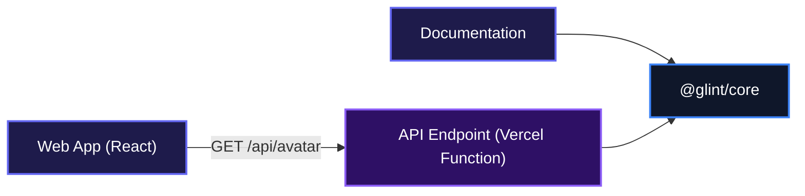
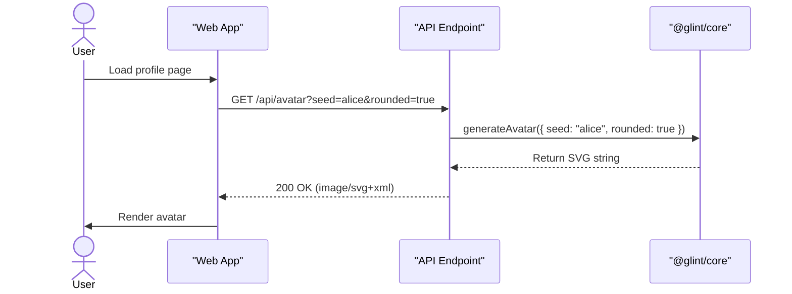

# Glint

Deterministic SVG avatar generator. Feed it any string and you'll always get the same unique avatar back, no storage or network calls needed.

## Overview

Glint takes a seed, hashes it deterministically, and produces a consistent SVG avatar every time. It's perfect for placeholder avatars, user profiles, or any scenario where you need a reliable visual identifier without external dependencies. The same seed will always generate the same gradient, initials, and styling, no matter where you run it.

## System Architecture

The project is organized as a pnpm monorepo with a shared core library, two frontend apps, and a serverless function that exposes the avatar generation as an HTTP endpoint.



## Installation

1. Clone the repository:

   ```bash
   git clone git@github.com:Charmingdc/glint
   cd glint
   ```

2. Install dependencies (requires pnpm):

   ```bash
   pnpm install
   ```

## Usage

### Core library

Install `@glint/core` in your project:

```bash
npm install @glint/core
```

Then generate an avatar programmatically:

```ts
import { generateAvatar } from "@glint/core";

const svg = generateAvatar({ seed: "alice.wonder" });
const avatarUrl = `data:image/svg+xml;base64,${btoa(svg)}`;
```

You can customize the output with options like size, rounded shape, noise, and initials.

### HTTP endpoint

Once deployed (for example, on Vercel), you can request an avatar directly:

```
GET /api/avatar?seed=charlie&size=200&rounded=true
```

The endpoint returns an `image/svg+xml` response by default with an optional parameter `png` to get a png version instead, perfect for `` tags or background images.

## Features

### Deterministic avatar generation

The core logic uses a seed string to produce a consistent color palette and layout. Two requests with the same seed will always yield an identical SVG, making caching and identity matching trivial.



### Rich customization

Reshape and style avatars using simple parameters:

- `size` – pixel width and height
- `rounded` – toggle circular shape
- `noise` – add a subtle texture layer
- `blur` – soft depth effect
- `font` – custom typeface
- `name` – generate initials overlay

### Serverless-ready HTTP API

A single API route (`/api/avatar`) is included, ready for deployment on platforms like Vercel. No API keys, databases, or environment variables needed.

## Technologies Used

| Category            | Technology                  |
| ------------------- | --------------------------- |
| **Core library**    | TypeScript                  |
| **Frontend apps**   | React, Vite, TypeScript     |
| **HTTP function**   | Node.js (Vercel serverless) |
| **Package manager** | pnpm                        |
| **Tooling**         | tsx, ESLint                 |

## API Documentation

### GET /api/avatar

Generates an SVG avatar based on the provided query parameters. Returns `image/svg+xml`.

**Request** (query params):

| Param     | Type      | Default   | Description                                          |
| --------- | --------- | --------- | ---------------------------------------------------- |
| `seed`    | `string`  | required  | Determines gradient palette and layout               |
| `name`    | `string`  | —         | Renders up to 2‑character initials over the gradient |
| `size`    | `number`  | `128`     | Avatar width and height in pixels                    |
| `rounded` | `boolean` | `false`   | Renders as a circle when `true`                      |
| `font`    | `string`  | `"Inter"` | Font family for the initials                         |
| `noise`   | `boolean` | `true`    | Adds a subtle noise texture layer                    |
| `blur`    | `boolean` | `true`    | Adds a soft blur layer for depth                     |

**Response**:

```xml
<svg viewBox="0 0 200 200" width="200" height="200" xmlns="http://www.w3.org/2000/svg">
  <defs>
    <radialGradient id="…" … />
  </defs>
  <rect x="0" y="0" width="100%" height="100%" rx="100" ry="100" fill="url(#…)" />
  <text x="50%" y="50%" dominant-baseline="central" text-anchor="middle" font-family="Inter" font-size="80" fill="#fff">JD</text>
</svg>
```

**Errors**: The endpoint always returns a valid SVG; missing or invalid parameters fall back to sensible defaults (e.g., a random seed if none is supplied). No explicit error responses are sent.

**Authentication**: None required.

**Environment variables**: None – all configuration is passed via query parameters.

## Contributing

Contributions are welcome. To get started:

1. Fork the repository and create a branch from `main`
2. Install dependencies with `pnpm install`
3. Make your changes and verify they work using `pnpm build` and `pnpm typecheck`
4. Submit a pull request with a clear description of what you've changed

Please keep the code style consistent and add clear commit messages.

## Author Info

- LinkedIn: [https://linkedin.com/in/adebayo-muis](https://linkedin.com/in/adebayo-muis)
- X (Twitter): [https://x.com/charmingdc01](https://x.com/charmingdc01)

---

[](https://react.dev/)
[](https://nodejs.org/)
[](https://www.typescriptlang.org/)
[](https://pnpm.io/)

[](https://dokugen.samueltuoyo.com)
