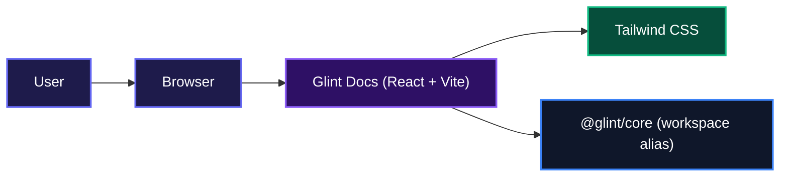
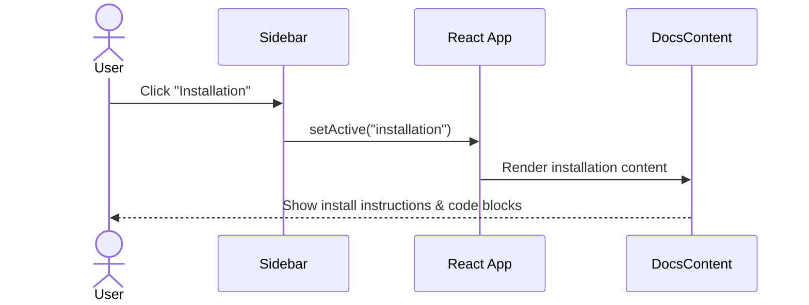

# Glint Docs - Deterministic Avatar Generator

The official documentation for [Glint](https://github.com/Charmingdc/glint), a zero‑dependency library that produces unique, deterministic avatars from any seed string. This site gives you a clear, structured reference to integrate Glint into your project quickly.

## Overview

Glint Docs is the home for everything you need to start using Glint. It guides you through installation, basic usage, the full API reference, and the HTTP endpoint. The site is fast, readable, and easy to navigate, so you spend less time reading docs and more time building.

## System Architecture

The documentation application is a lightweight React single‑page app that consumes the Glint core library locally during development.



## Installation

Get the documentation running locally in a few steps.

- **Clone the repository**  
  ```bash
  git clone git@github.com:Charmingdc/glint
  ```

- **Move into the docs directory**  
  ```bash
  cd glint/docs
  ```

- **Install dependencies**  
  This project uses the [pnpm](https://pnpm.io) workspace (or any compatible package manager).  
  ```bash
  pnpm install
  ```

- **Start the development server**  
  ```bash
  pnpm dev
  ```

The site will be available at `http://localhost:5173`.

- **Build for production** (static export)  
  ```bash
  pnpm build
  ```

## Usage

Once the dev server is running, open your browser and explore the documentation. The sidebar lets you jump between sections:

1. **Introduction** – Learn what Glint is and how it works.
2. **Installation** – Instructions for adding Glint to your own project.
3. **Usage** – Basic examples, including React integration.
4. **API Reference** – Full breakdown of `generateAvatar` options.
5. **Initials** – How name‑based initials are extracted and styled.
6. **HTTP API** – Reference for the serverless endpoint (`/api/avatar`).
7. **TypeScript** – Types shipped with the library.

## Features

### Structured Navigation

A sticky sidebar makes it effortless to jump between topics. The active section is highlighted, and the content switches instantly without page reloads.



### Developer‑Friendly Dark Theme

The entire docs app ships with a custom dark colour palette, high contrast code blocks, and a clean typography stack built on Inter. No eye strain, no distractions.

### Code‑First Documentation

Every concept is accompanied by runnable code snippets. Custom `Code` and `InlineCode` components provide syntax highlighting and copy‑friendly formatting, so you can drop examples directly into your project.

### Responsive Layout

The documentation adapts seamlessly from large desktops to tablets and phones. The sidebar collapses and content reflows, keeping everything readable regardless of screen size.

## Technologies Used

| Technology       | Link                                        |
| ---------------- | ------------------------------------------- |
| React 19         | [react.dev](https://react.dev)              |
| TypeScript       | [typescriptlang.org](https://www.typescriptlang.org) |
| Vite             | [vitejs.dev](https://vitejs.dev)            |
| Tailwind CSS      | [tailwindcss.com](https://tailwindcss.com)  |
| Motion (prev. Framer Motion) | [motion.dev](https://motion.dev) |
| HugeIcons        | [hugeicons.com](https://hugeicons.com)      |

## Contributing

The Glint project welcomes contributions. Please open an issue or pull request on the [main repository](https://github.com/Charmingdc/glint). For detailed guidelines, check the repository root for a `CONTRIBUTING.md` file.

## Author

Built by [Adebayo Muis](https://linkedin.com/in/adebayo-muis).

- **LinkedIn** – [linkedin.com/in/adebayo-muis](https://linkedin.com/in/adebayo-muis)
- **X (Twitter)** – [x.com/charmingdc01](https://x.com/charmingdc01)

## Badges

[](https://www.typescriptlang.org/)
[](https://react.dev)
[](https://vitejs.dev)
[](https://tailwindcss.com)

[](https://dokugen.samueltuoyo.com)