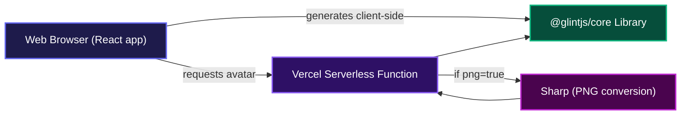
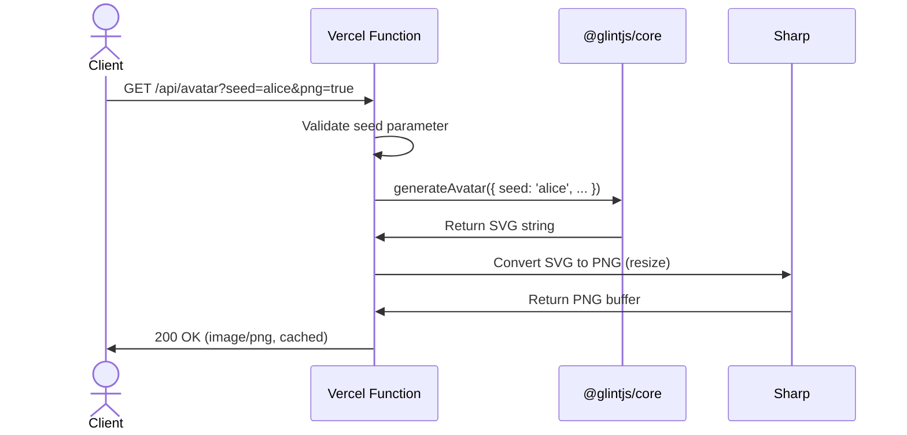
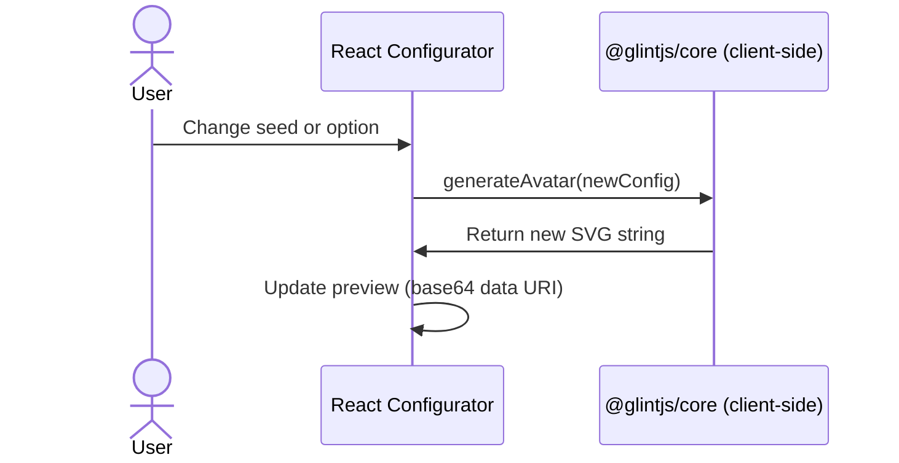

# Glint — Deterministic Avatar Generator

**Generate unique, deterministic avatars from any seed. Drop Glint into your project via a simple API call or use our interactive configurator to tweak every detail, no heavy dependencies or accounts required.**

## Overview

Glint gives you an avatar from any string you throw at it. You can call the hosted API to get an SVG or PNG back instantly, or you can spin up the frontend and play with sizes, fonts, and shapes in real time. It's dead simple, consistent, and free, built for developers who just want a reliable avatar generator that works the same way every time.

## System Architecture



The frontend can generate avatars directly using the `@glintjs/core` library, or it can delegate to the API. The serverless function also uses `@glintjs/core` and optionally converts the SVG to PNG with Sharp, then caches aggressively for maximum speed.

## Installation

Clone the repository and install dependencies:

```bash
git clone git@github.com:Charmingdc/glint
cd glint
npm install
```

The project uses a monorepo layout; the web app lives in this package and the core library is linked locally. After installing, you can start the development server:

```bash
npm run dev
```

The app will be available at `http://localhost:5173`.

## Usage

### Live configurator (web UI)

Once the dev server is running, you'll see the Glint landing page. The navbar includes a small avatar button—click it to open a real-time configurator where you can change every parameter and watch the avatar update instantly.

### API endpoint

The same generation logic is exposed as a serverless API. You can request an avatar directly from a URL:

```bash
# SVG (default)
curl "https://your-deployment.vercel.app/api/avatar?seed=JohnDoe&size=128&rounded=true"

# PNG
curl "https://your-deployment.vercel.app/api/avatar?seed=JohnDoe&size=256&png=true"
```

The API responds with the image and sets long-lived cache headers, so it's safe to use in `` tags everywhere.

### Using the core library directly

If you'd rather generate avatars on your own server or client, import the function:

```ts
import { generateAvatar } from '@glintjs/core';

const svg = generateAvatar({
  seed: 'user-123',
  size: 96,
  rounded: true,
  noise: true,
  blur: false,
});
```

The core package is contained in the same monorepo (`packages/core`).

## Features

**Deterministic generation**  
The same seed always produces the exact same avatar. Perfect for user profiles, identicons, or placeholder images where consistency matters.



**Real-time configurator**  
Tweak the seed, size, rounded corners, noise, blur, and font right from the browser and see the result live. No page reloads.



**Flexible output formats**  
Request an SVG or a PNG from the API. The API uses Sharp for smooth rasterization, and the PNG response is fully cached.

**Simple styling knobs**  
Adjust the font family, toggle noise and blur effects, and switch between rounded and square shapes, all without touching a line of code.

## Technologies Used

| Technology | Use |
|------------|-----|
| [TypeScript](https://www.typescriptlang.org/) | Type-safe code across frontend and API |
| [React](https://react.dev/) | UI components and configurator |
| [Vite](https://vitejs.dev/) | Build tool and dev server |
| [Tailwind CSS](https://tailwindcss.com/) | Utility-first styling |
| [Motion](https://motion.dev/) | Animations (formerly Framer Motion) |
| [Hugeicons](https://hugeicons.com/) | Icon family |
| [Sharp](https://sharp.pixelplumbing.com/) | High-performance SVG-to-PNG conversion |
| [@glintjs/core](https://github.com/Charmingdc/glint) | Deterministic avatar generation logic |
| [Vercel Serverless Functions](https://vercel.com/docs/functions) | API endpoint hosting |

## API Documentation

The project exposes a single endpoint for programmatic avatar generation.

### `GET /api/avatar`

**Description**: Generates an avatar as SVG (default) or PNG and returns the image with long-lived caching headers.

**Query Parameters**

| Parameter | Type | Required | Default | Description |
|-----------|------|----------|---------|-------------|
| `seed` | string | Yes | — | The unique seed used to generate the avatar |
| `name` | string | No | — | If provided, avatar will display the initials |
| `size` | number | No | `128` | Width/height of the output image (px) |
| `rounded` | boolean | No | `true` | If `"false"`, corners are square |
| `font` | string | No | `"Inter"` | Font family used for initials (e.g. `monospace`, `Georgia`) |
| `noise` | boolean | No | `true` | Adds a subtle noise texture |
| `blur` | boolean | No | `true` | Applies a soft blur effect |
| `png` | boolean | No | `false` | Set to `"true"` to receive a PNG instead of SVG |

**Example Request**

```bash
curl "https://glint-dev.vercel.app/api/avatar?seed=JaneDoe&size=200&font=Georgia&noise=false&png=true" --output avatar.png
```

**Example Response (when `png=true`)**

```
HTTP/1.1 200 OK
Content-Type: image/png
Cache-Control: public, max-age=31536000, immutable
{ binary PNG data }
```

**Errors**

- **400** — Returned when the required `seed` parameter is missing or empty.

  ```json
  {
    "error": "Missing required query parameter: seed"
  }
  ```

## Contributing

Pull requests and issues are welcome. There's no formal contribution guide yet, but feel free to open a discussion if you'd like to improve something.

## Author

- **Adebayo Muis**
  - LinkedIn: [https://linkedin.com/in/adebayo-muis](https://linkedin.com/in/adebayo-muis)
  - X (Twitter): [https://x.com/charmingdc01](https://x.com/charmingdc01)

---

[](https://www.typescriptlang.org/)
[](https://react.dev/)
[](https://vitejs.dev/)
[](https://tailwindcss.com/)
[](https://vercel.com/)

[](https://dokugen.samueltuoyo.com)