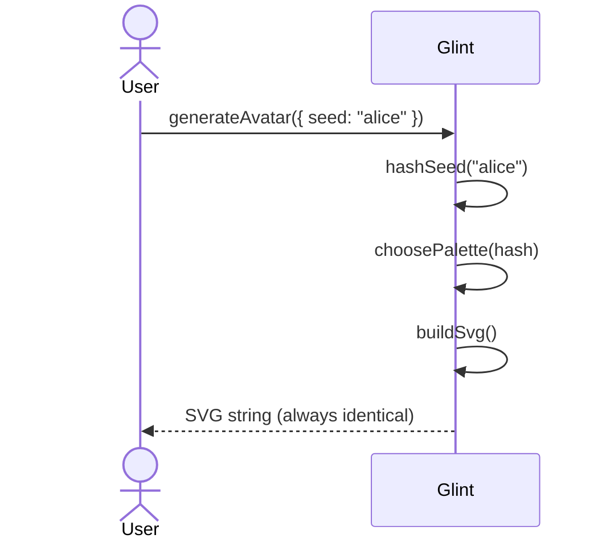
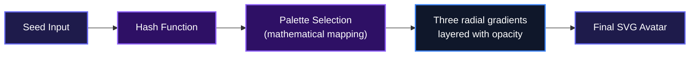
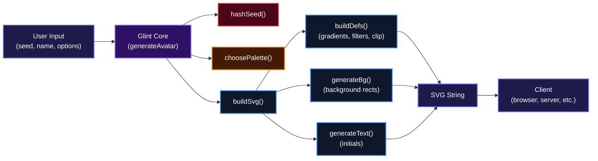

# Glint

Beautiful, deterministic gradient avatars. Give it a seed, get back a unique SVG avatar that's always the same for that seed. Perfect for user profiles when you don't have photos.

## Overview

Most apps fall back to boring gray circles or generic initials when a user hasn't uploaded a photo. Glint changes that by turning any text seed into a vibrant, multi-layered gradient avatar. Every seed produces a repeatable, visually distinct image, no randomness involved. It's small, fast, and works anywhere JavaScript runs, from the browser to the edge.

## Installation

Clone the repository and install dependencies:

```bash
git clone git@github.com:Charmingdc/glint
cd glint
npm install
```

Then build the library:

```bash
npm run build
```

Or install it directly via npm:

```bash
npm install @glintjs/core
```

## Usage

Import `generateAvatar` and call it with a seed and optional configuration. The function returns an SVG string you can embed directly in HTML, React, or any frontend framework.

```ts
import { generateAvatar } from "@glintjs/core";

const svg = generateAvatar({ seed: "user-123" });

// Use in a browser
document.getElementById("avatar").innerHTML = svg;

// Or in React
function Avatar({ seed }: { seed: string }) {
  const svg = generateAvatar({ seed });
  return <div dangerouslySetInnerHTML={{ __html: svg }} />;
}
```

You can customize size, shape, font, and visual effects:

```ts
generateAvatar({
  seed: "jane.doe@example.com",
  name: "Jane Doe",       // optional, adds initials overlay
  size: 200,              // default 128
  rounded: true,          // circle instead of square
  font: "Inter",          // font family for initials
  noise: true,            // subtle grain texture (default true)
  blur: true              // soft blur on background (default true)
});
```

Turning off both `noise` and `blur` gives you a clean, flat gradient:

```ts
generateAvatar({ seed: "flat-profile", noise: false, blur: false });
```

All options except `seed` are optional and come with sensible defaults.

## Features

### Deterministic Generation

Every seed produces the exact same avatar every time. The hashing algorithm (djb2) guarantees consistent results across runs and machines, so you'll never get a different image for the same user.



### Rich Gradient Palettes

Glint ships with 30 hand-picked gradient palettes, from warm solar flares to neon orchids. The palette selection is also deterministic, so every seed gets a consistent color scheme that never looks random or clashing.



### Optional Initials Overlay

When you pass a name alongside the seed, Glint extracts and centers initials on the avatar. This gives a human touch without sacrificing the gradient aesthetic.

### Visual Effects (Noise & Blur)

Subtle grain and a soft blur add depth to the gradients, making the avatars look more polished. Both effects are enabled by default and can be toggled off for a flatter, cleaner look.

### Fully Customizable

Control size, corner rounding, font family, and more. Glint fits into any design system without fighting it.

## System Architecture

Glint follows a simple pipeline: hash the seed, pick a palette, build SVG fragments (definitions, background, text), and return a complete SVG string. No external dependencies, no network calls, just pure computation.



## Technologies Used

| Technology | Purpose |
|---|---|
| [TypeScript](https://www.typescriptlang.org/) | Core language, type safety |
| [tsup](https://tsup.egoist.dev/) | Bundling for ESM and CJS |
| Node.js | Runtime environment for development & build |

## Contributing

Contributions are welcome! If you'd like to improve Glint, here's how you can help:

- **Report bugs** by opening an issue with a clear reproduction.
- **Suggest palettes** or visual improvements.
- **Add features** like more output formats (canvas, PNG), tests, or configuration options.
- **Write documentation** or examples.

Before submitting a pull request, make sure your code builds cleanly and follows the existing style. All contributions are MIT-licensed.

For more details, check the [issue tracker](https://github.com/charmingdc/glint/issues).

## License

This project is licensed under the MIT License. See the [LICENSE](./LICENSE.txt) file for details.

## Author

**Adebayo Muis**

- LinkedIn: [https://linkedin.com/in/adebayo-muis](https://linkedin.com/in/adebayo-muis)
- X (Twitter): [https://x.com/charmingdc01](https://x.com/charmingdc01)

## Badges

[](https://www.typescriptlang.org/)
[](https://nodejs.org/)
[](https://www.npmjs.com/package/@glintjs/core)

---

[](https://dokugen.samueltuoyo.com)