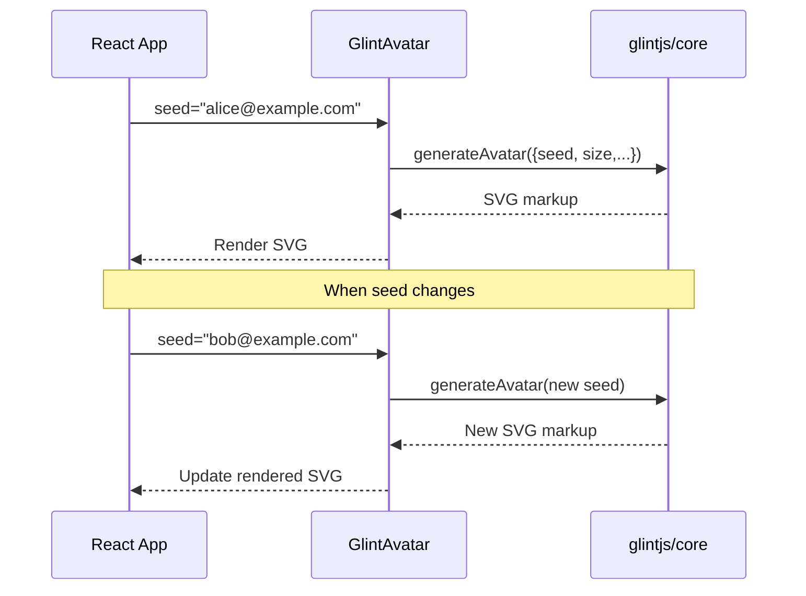

# Glint Avatar for React

A tiny React component that generates beautiful, deterministic gradient avatars from a seed string. No external service calls, no random placeholders, just consistent and good-looking avatars every time.

## Installation

Clone the repository and install dependencies:

```bash
git clone git@github.com:Charmingdc/glint
cd glint/packages/react
npm install
```

To build the library:

```bash
npm run build
```

You can also install it directly from npm:

```bash
npm install @glintjs/react
```

The package works with React 18 and 19.

## Usage

Import the `GlintAvatar` component and pass a seed string. All other props are optional.

```tsx
import { GlintAvatar } from "@glintjs/react";

function UserCard() {
  return (
    <div>
      <GlintAvatar seed="user@example.com" size="lg" />
      <h2>John Doe</h2>
    </div>
  );
}
```

### Props

| Prop         | Type                             | Default          | Description                                                    |
| ------------ | -------------------------------- | ---------------- | -------------------------------------------------------------- |
| `seed`       | `string`                         | (required)       | Deterministic input that defines the avatar's appearance.      |
| `name`       | `string`                         | `undefined`      | Accessible label; falls back to `seed` if not set.             |
| `size`       | `"sm" \| "md" \| "lg" \| number` | `"md"`           | Avatar size in pixels or a preset (`sm`=32, `md`=48, `lg`=64). |
| `rounded`    | `number \| boolean`              | `undefined`      | Controls border-radius for rounded corners.                    |
| `font`       | `string`                         | `undefined`      | Custom font family for any text overlay.                       |
| `noise`      | `number`                         | `undefined`      | Amount of grain / texture applied.                             |
| `blur`       | `number`                         | `undefined`      | Gaussian blur radius.                                          |
| `className`  | `string`                         | `undefined`      | CSS class forwarded to the wrapper div.                        |
| `style`      | `CSSProperties`                  | `undefined`      | Inline styles for the wrapper.                                 |
| `role`       | `string`                         | `"img"`          | ARIA role.                                                     |
| `aria-label` | `string`                         | `name \|\| seed` | Accessible label.                                              |

## Features

### Deterministic Gradient Generation

Every avatar is generated purely from the seed you provide. The same seed will always produce the same avatar, making it perfect for user identities where consistency matters. Internally, the seed is hashed and used to drive the gradient colors, noise, and optional blur.

```mermaid
flowchart LR
  Seed["Input Seed"]
  Hash["Create Hash"]
  Colors["Pick Colors"]
  Gradient["Build Gradient"]
  Filters["Apply Noise / Blur"]
  SVG["SVG Output"]

  Seed --> Hash --> Colors --> Gradient --> Filters --> SVG

  style Seed fill:#1e1b4b,stroke:#6366f1,stroke-width:2px,color:#fff
  style Hash fill:#2e1065,stroke:#8b5cf6,stroke-width:2px,color:#fff
  style Colors fill:#042f2e,stroke:#14b8a6,stroke-width:2px,color:#fff
  style Gradient fill:#042f2e,stroke:#14b8a6,stroke-width:2px,color:#fff
  style Filters fill:#f59e0b,stroke:#f59e0b,stroke-width:2px,color:#fff
  style SVG fill:#1D3557,stroke:#457B9D,stroke-width:2px,color:#fff
```



### Smart Memoization

The component is wrapped in `React.memo` and relies on `useMemo` to only regenerate the SVG when the props actually change. Even if your parent re-renders frequently, the avatar stays performant.



### Fully Customizable

Go beyond the basics. Tweak the size, roundness, noise, and blur to match your design system. Every visual detail can be controlled via simple props, without writing CSS.

### Accessible by Default

The component sets `role="img"` and uses the `name` prop (or the seed) as an `aria-label`. Assistive technologies understand your avatars out of the box, and you can override these attributes if needed.

## System Architecture

The library is a thin React wrapper around the core generator. Everything runs on the client side with zero network requests.


## Technologies Used

| Technology                                          | Purpose                  |
| --------------------------------------------------- | ------------------------ |
| [React](https://react.dev/)                         | UI library               |
| [TypeScript](https://www.typescriptlang.org/)       | Type safety              |
| [glintjs/core](https://github.com/charmingdc/glint) | Avatar generation engine |
| [tsup](https://tsup.egoist.dev/)                    | Build tool for ESM/CJS   |

## Contributing

Contributions are welcome! If you'd like to improve the component or the underlying generation logic, feel free to open an issue or a pull request on the [GitHub repository](https://github.com/charmingdc/glint).

## License

This project is licensed under the MIT License. See [LICENSE](./LICENSE.txt) for details.

## Author

- LinkedIn: [Adebayo Muis](https://linkedin.com/in/adebayo-muis)
- X (Twitter): [@charmingdc01](https://x.com/charmingdc01)

---

[](https://dokugen.samueltuoyo.com)

---

## Badges

[](https://www.typescriptlang.org/)
[](https://react.dev/)
[](https://opensource.org/licenses/MIT)
